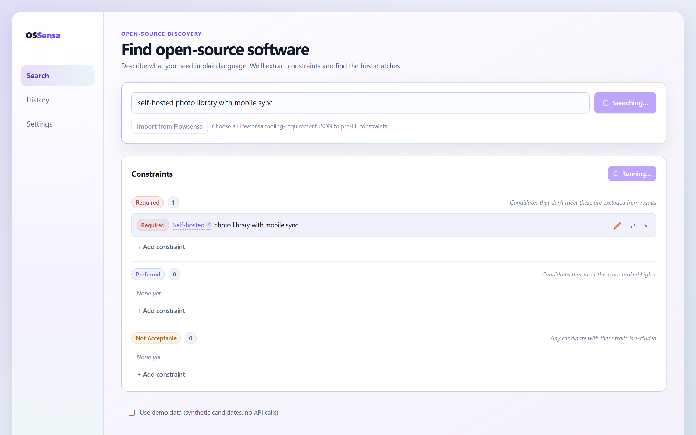

# OSSensa

Describe what you need in plain language; get a ranked, evidence-backed shortlist of open-source software — with every claim traced to its source.

[**Live demo**](https://ossensa.vercel.app)

[](LICENSE)



## How discovery works

```
your words → query expansion → source fan-out → identity resolution
           → bounded evidence retrieval → licence gate → ranked top 5
           + a coverage report of what was searched, failed, or skipped
```

Candidates come from GitHub, GitLab, Codeberg, npm, crates.io, Packagist, and Wikipedia, with vulnerability evidence from OSV.dev — all keyless public APIs called from your browser.

## Trust rules

- A candidate is labelled **OSI open source** only when SPDX metadata or a retrieved licence file supports it — AI output can't set it.
- Conflicting claims are shown as conflicts, never silently resolved.
- Every claim carries its source URL, retrieval time, and provenance type; demo data is never substituted for a failed live search.

## Quick start

```bash
npm install
npm run dev      # http://localhost:5173
vercel dev       # full stack, including the evidence-retrieval function
```

Toggle **Demo mode** on the search screen to explore with synthetic candidates and no API calls. `npm test` runs the offline unit tests; `npm run test:e2e` runs Playwright with mocked sources.

## How it's built

A deterministic domain core (constraint matching, ranking) under `src/domain/`, discovery adapters and identity resolution under `src/lib/discovery/`, and an optional SSRF-guarded serverless function (`api/fetch.ts`) that retrieves licence and official-site evidence the browser can't reach. Optional AI summaries use your own OpenRouter key, held in session memory only.

## License

[MIT](LICENSE)
